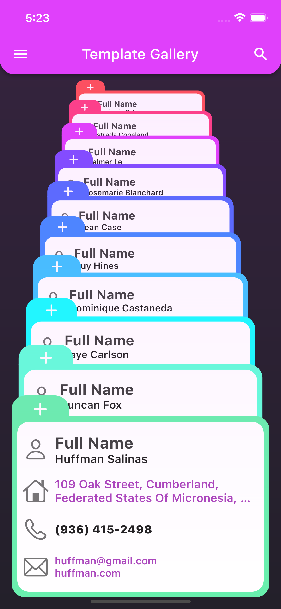
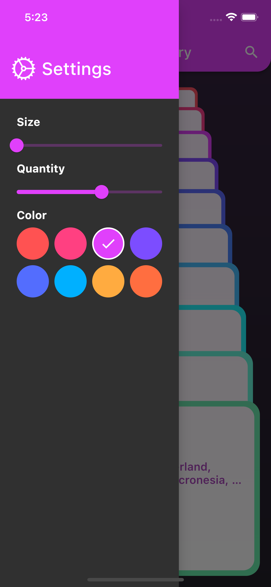
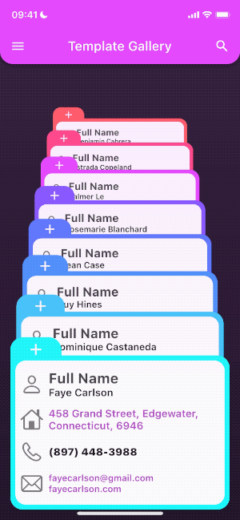

# Сards - Flutter UI Challenge

#### Based on [Flutter Animation](https://www.youtube.com/watch?v=YeV2ZYn2_JI&t=686s&ab_channel=diegoveloper) tutorial with additions:
* state management
* additional functionality
* ui fix

 | List View| Settings Drawer |
 |-----------|-----------|
 || |

 | List View GIF | Settings Drawer GIF |
 |-----------|-----------|
 || |

